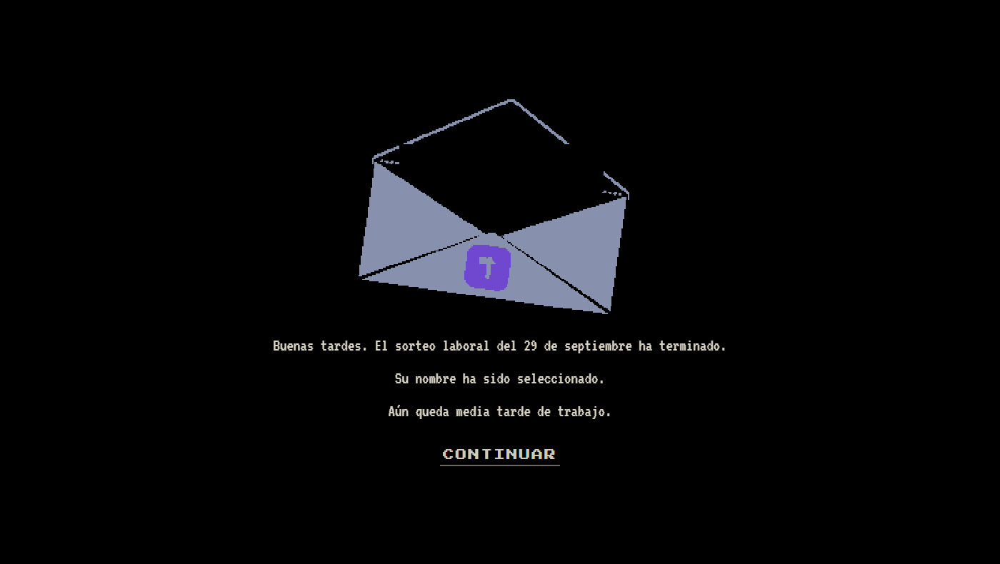

<div align="center">



# 🎮 Papers, Please — Portfolio

**Un portfolio interactivo disfrazado de puesto de inspección fronteriza.**

Mario Muñoz Pequeño · Técnico Superior en Desarrollo de Aplicaciones Multiplataforma

[](https://mariomunpeq.github.io/Papers-Please-Portfolio/)
[](https://github.com/MarioMunPeq/Papers-Please-Portfolio/actions/workflows/deploy.yml)


[**▶ Abrir el portfolio**](https://mariomunpeq.github.io/Papers-Please-Portfolio/) · [**Ver el código**](https://github.com/MarioMunPeq/Papers-Please-Portfolio)

</div>

---

## ¿Qué es esto?

En lugar de una lista de proyectos, este portfolio es **el juego**: entras por una cinta
transportadora de solicitudes, y cada candidato que se acerca a tu mesa trae su documentación.
Tu trabajo es revisarla, sellarla y decidir.

Cada documento es una sección real del portfolio —el pasaporte es el perfil, el visado son los
proyectos, el manual de protocolo son las tecnologías— y el trabajo de desk del juego está
implementado de verdad: **arrastrar, comparar, sellar y decidir**.

Todo está hecho con React y TypeScript, sin motores gráficos ni librerías de UI.
El renderizado es pixel a pixel sobre sprites originales, escalado con
`image-rendering: pixelated` para que se vea nítido a cualquier tamaño.

## 🧾 Cómo se juega

1. **Intro de 6 pantallas.** El Ministerio de Admisión te explica el puesto. La fecha, la hora y
   el texto cambian según cuándo abras la página.
2. **Llega un solicitante.** Se abre su expediente en la mesa de inspección.
3. **Arrastra los documentos** desde la bandeja de la izquierda hasta la mesa.
4. **Comprueba los datos** de cada campo: nombres, fechas, números de permiso, fotografía.
5. **Sella con `APROBAR` o `DENEGAR`.** El sello es definitivo; el documento se archiva.
6. **Llama al siguiente** con el botón `CONTINUAR`.
7. Si algo va mal, haz **clic en la sirena** para pedir apoyo.
8. Cuando quieras ver **los proyectos de verdad**, pulsa `PROYECTOS` en la esquina del escritorio:
   sale un panel con cada uno y sus dos enlaces, al repositorio y a la demo en vivo.

## 🗂 Proyectos

El mismo panel, en texto plano. Todos tienen repo y demo en vivo.

| Proyecto | Qué es | Stack | Enlaces |
|---|---|---|---|
| [Repository-Library](https://github.com/MarioMunPeq/Repository-Library) | Portfolio con estética de biblioteca de Steam | TypeScript | [repo](https://github.com/MarioMunPeq/Repository-Library) · [demo](https://mariomunpeq.github.io/Repository-Library/) |
| [portfolio-persona5](https://github.com/MarioMunPeq/portfolio-persona5) | CV viviente con estética de Persona 5 | TypeScript | [repo](https://github.com/MarioMunPeq/portfolio-persona5) · [demo](http://mariomunpeq.is-a.dev/) |
| [Vault-Archive](https://github.com/MarioMunPeq/Vault-Archive) | Portfolio dentro de un Pip-Boy 3000 de Fallout 3 | TypeScript | [repo](https://github.com/MarioMunPeq/Vault-Archive) · [demo](https://mariomunpeq.github.io/Vault-Archive/) |
| [Dungeon-Archive](https://github.com/MarioMunPeq/Dungeon-Archive) | Referencia de D&D 5e, offline y mobile-first | TypeScript | [repo](https://github.com/MarioMunPeq/Dungeon-Archive) · [demo](https://mariomunpeq.github.io/Dungeon-Archive/) |
| [Cosmere-Archive](https://github.com/MarioMunPeq/Cosmere-Archive) | Archivo visual interactivo del universo de Cosmere | TypeScript | [repo](https://github.com/MarioMunPeq/Cosmere-Archive) · [demo](https://mariomunpeq.github.io/Cosmere-Archive/) |
| [Euromario](https://github.com/MarioMunPeq/Euromario) | Noticias de videojuegos resumidas con IA cada 24 h | Python | [repo](https://github.com/MarioMunPeq/Euromario) · [demo](https://mariomunpeq.github.io/Euromario/) |

## ✨ Detalles que hacen el proyecto

| | |
|---|---|
| 🕐 **Intro dinámica** | Fecha, hora real, día de la semana y saludo según la franja del día |
| 🎄 **Festivos reales** | 12 festivos nacionales + 2 de Castilla y León, con Jueves y Viernes Santo calculados por el algoritmo de Pascua |
| 🐙 **GitHub en vivo** | La pantalla de inspección consulta la API de GitHub y muestra tu repo más reciente y cuándo lo subiste |
| 🔤 **Fuente de bitmap** | Los textos se dibujan con una fuente pixel real cargada como bitmap, no con la del sistema |
| 🎧 **Audio por eventos** | Cada acción tiene su sonido: papel, metal, sellos, botones, sirena, ambiente y la banda sonora de la intro |
| 🖱️ **Arrastre real** | El papel tiene peso: se coge, se mueve, se suelta y cae a la bandeja si lo mandas fuera |
| 🧾 **8 documentos** | Pasaporte, DNI, permiso de trabajo, autorización diplomática, visado, registro de habilidades, certificaciones y manual de protocolo |

## 🧩 La intro dinámica

Los textos de la intro viven en `src/portfolioData.ts` y aceptan etiquetas que se sustituyen al
cargar la página. Puedes reescribir los que quieras sin tocar la lógica:

| Etiqueta | Qué muestra | Ejemplo |
|---|---|---|
| `{dia}` `{mes}` `{anio}` | Fecha actual | `29` `septiembre` `2026` |
| `{diaSemana}` | Día de la semana | `martes` |
| `{hora}` | Hora local en 24 h | `14:32` |
| `{saludo}` | Según la hora | `Buenos días` / `Buenas noches` |
| `{frase}` | Una línea según la franja | `Aún queda media tarde de trabajo.` |
| `{festivo}` | Festivo que cae hoy | `Navidad` |
| `{repo}` `{push}` `{lenguaje}` | Repo más reciente de GitHub | `Papers-Please-Portfolio` |
| `{norepos}` | Número de repos públicos | `20` |

Ejemplo de una pantalla:

```ts
{
  image: `${CLEAN}/Intro0.png`,
  alt: 'Carta del Ministerio de Admisión de {mes}',
  lines: [
    '{saludo}. El sorteo laboral de {mes} ha terminado.',
    'Su nombre ha sido seleccionado.',
    '{frase}',
  ],
  festivo: ['Hoy es {festivo}. Se concede una pausa.'],   // solo si hoy es festivo
  cta: 'CONTINUAR',
}
```

`festivo` es opcional: la línea desaparece los días normales. Y si la API de GitHub no responde o
se agota el límite de peticiones, la pantalla degrada a un texto de reserva sin romperse.

### Herramientas de desarrollo

| URL | Qué hace |
|---|---|
| `?fecha=2026-12-25` | Fuerza una fecha, para ver la intro de Navidad sin esperar a diciembre |
| `?sheet=1` | Muestra la maquetación de todos los documentos a la vez |

## 🛠️ Puesta en marcha

```bash
npm install
npm run dev
```

La url de desarrollo incluye el nombre del repo
(`http://localhost:5173/Papers-Please-Portfolio/`), igual que en producción, para que lo que
pruebes sea exactamente lo que se publica.

| Script | Qué hace |
|---|---|
| `npm run dev` | Servidor de desarrollo con HMR |
| `npm run build` | Comprueba tipos y compila a `dist/` |
| `npm run lint` | ESLint |
| `npm run preview` | Sirve `dist/` como lo hará GitHub Pages |

## 🚀 Despliegue

Cada `push` a `main` dispara `.github/workflows/deploy.yml`, que instala, pasa el lint, compila y
publica en GitHub Pages. No hace falta hacer nada más: el sitio se actualiza solo.

> **Si cambias el nombre del repo**, actualiza el `base` de `vite.config.ts` para que coincida
> con el nuevo nombre, o las rutas dejarán de encontrar los archivos.

## 📁 Estructura

```
src/
├── App.tsx            escena del juego: intro, mesa, documentos, arrastre y sellado
├── App.css            estilos, escalado pixel-perfect y animations
├── audio.ts           motor de sonido por eventos
├── bitmapFont.tsx     fuente de bitmap para el texto pixelado
├── Proyectos.tsx      panel con los proyectos y sus enlaces
├── introData.ts       calendario, hora, festivos y consulta de GitHub
├── paths.ts           rutas de assets con el prefijo de GitHub Pages
└── portfolioData.ts    el contenido: textos de la intro y de los 8 documentos
public/
├── assets/            documentos, avatar e iconos
├── assets-english/    sprites del juego: intro, border, checkpoint y fuente bitmap
├── audios/            música y efectos
└── fonts/             Press Start 2P y VT323
```

Todo el contenido —textos, imágenes y posiciones de cada campo— está en `portfolioData.ts`.
No hace falta tocar la lógica para cambiar lo que dice el portfolio.

## ⚖️ Créditos y aviso legal

> Este es un **proyecto personal, educativo y no comercial**. No está afiliado ni patrocinado por
> los creadores de *Papers, Please*.

- **Papers, Please** y todos sus gráficos, sprites y efectos de sonido son obra de
  **Lucas Pope** (3909 LLC). Los recursos originales de este proyecto proceden del juego.
- Tipografías: [Press Start 2P](https://fonts.google.com/specimen/Press+Start+2P) y
  [VT323](https://fonts.google.com/specimen/VT323), bajo SIL Open Font License.
- Si eres el titular de los derechos y quieres que se retire algún recurso,
  [abre un issue](https://github.com/MarioMunPeq/Papers-Please-Portfolio/issues) y se eliminará.

<div align="center">
  <sub>Hecho con React, TypeScript y mucho papeleo.</sub>
</div>
